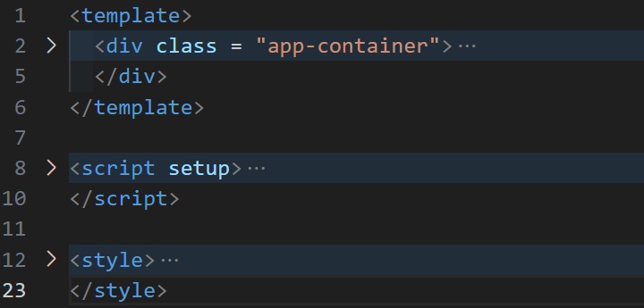
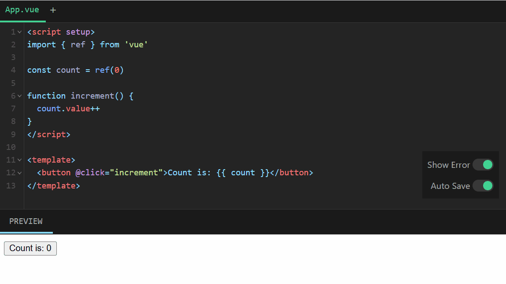
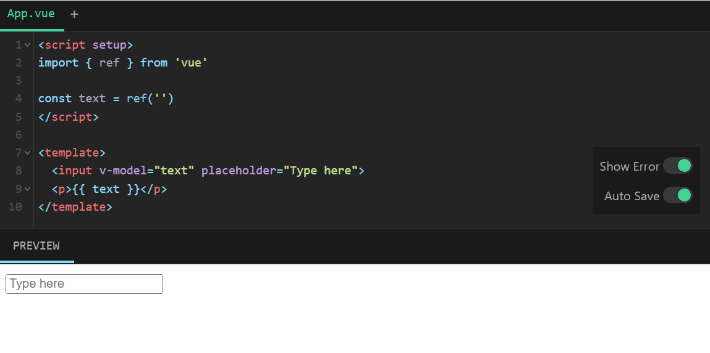
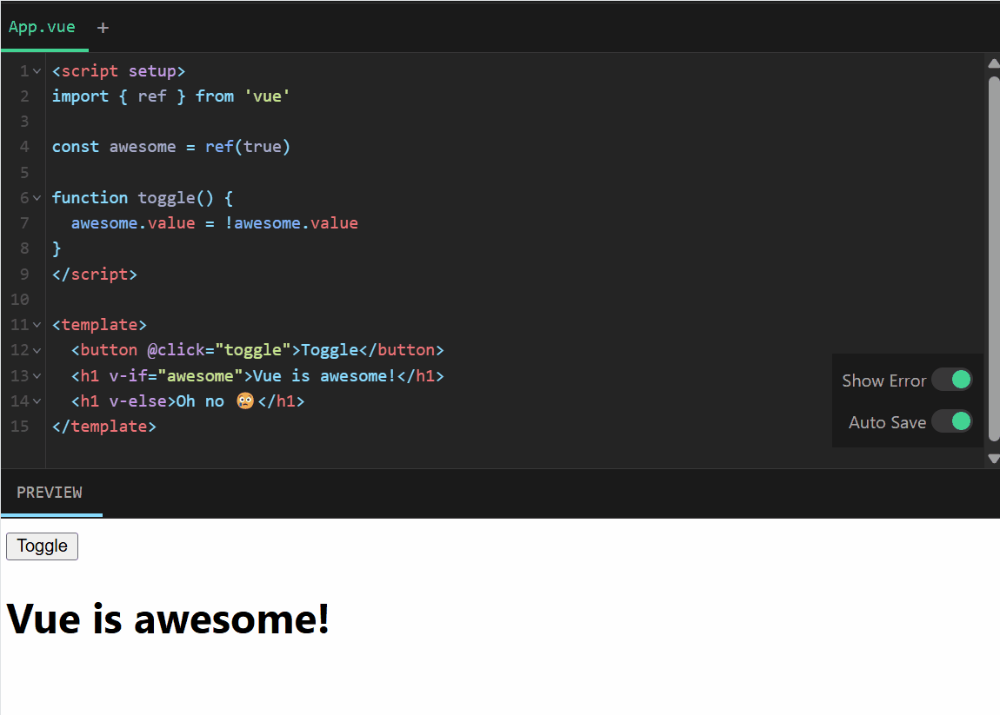
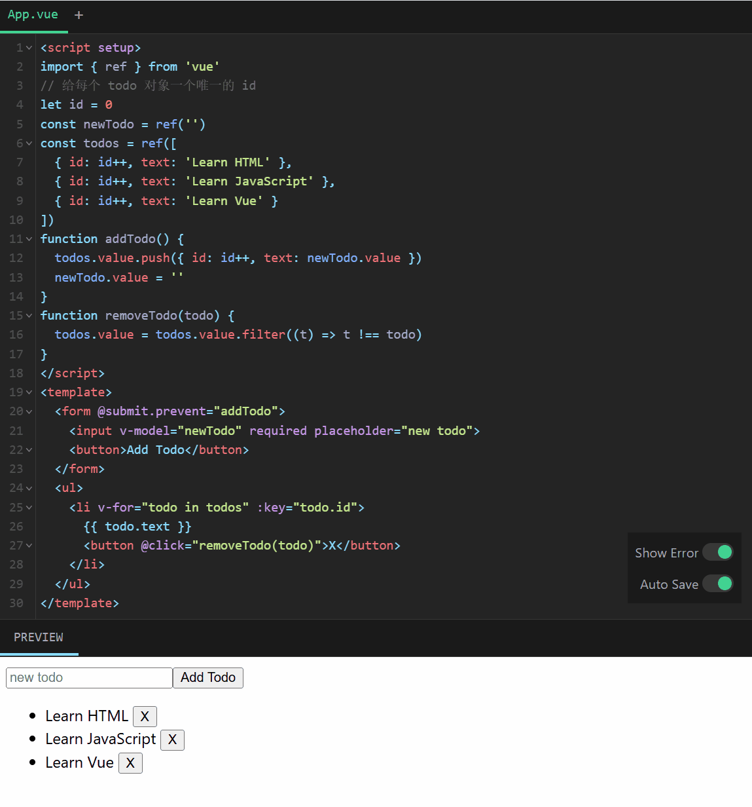
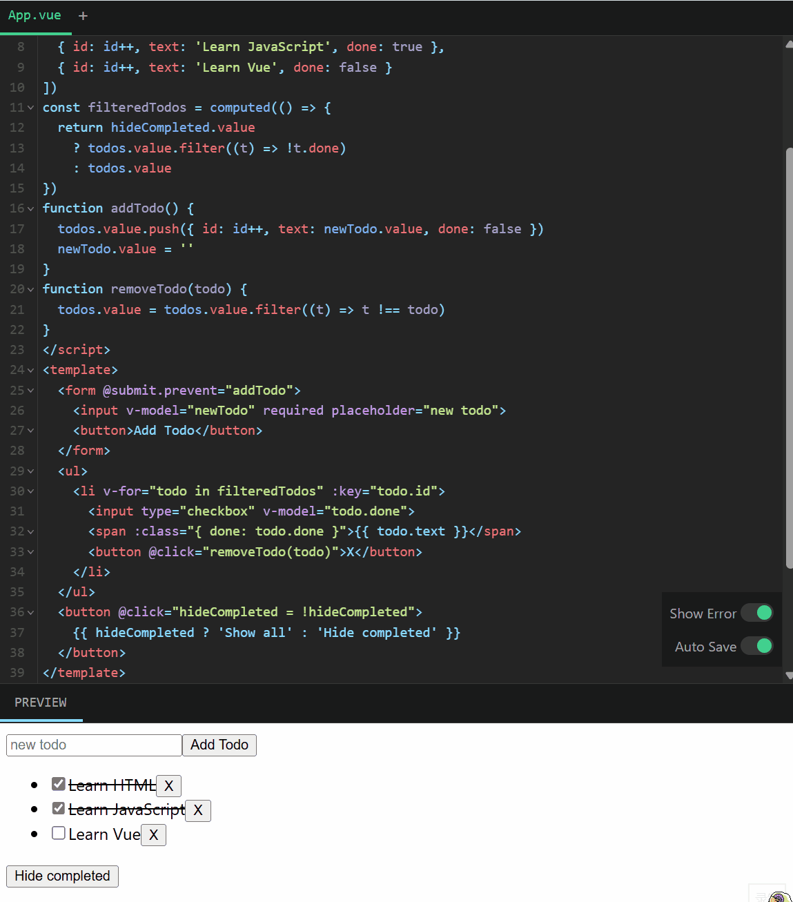
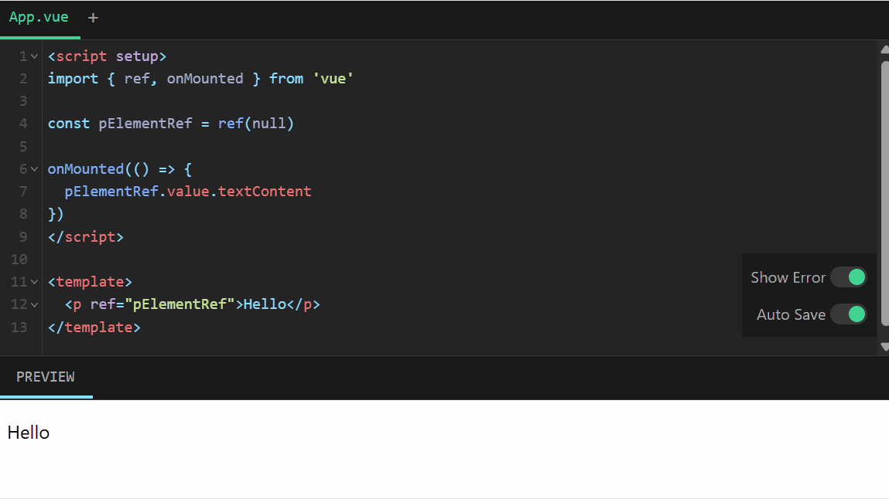
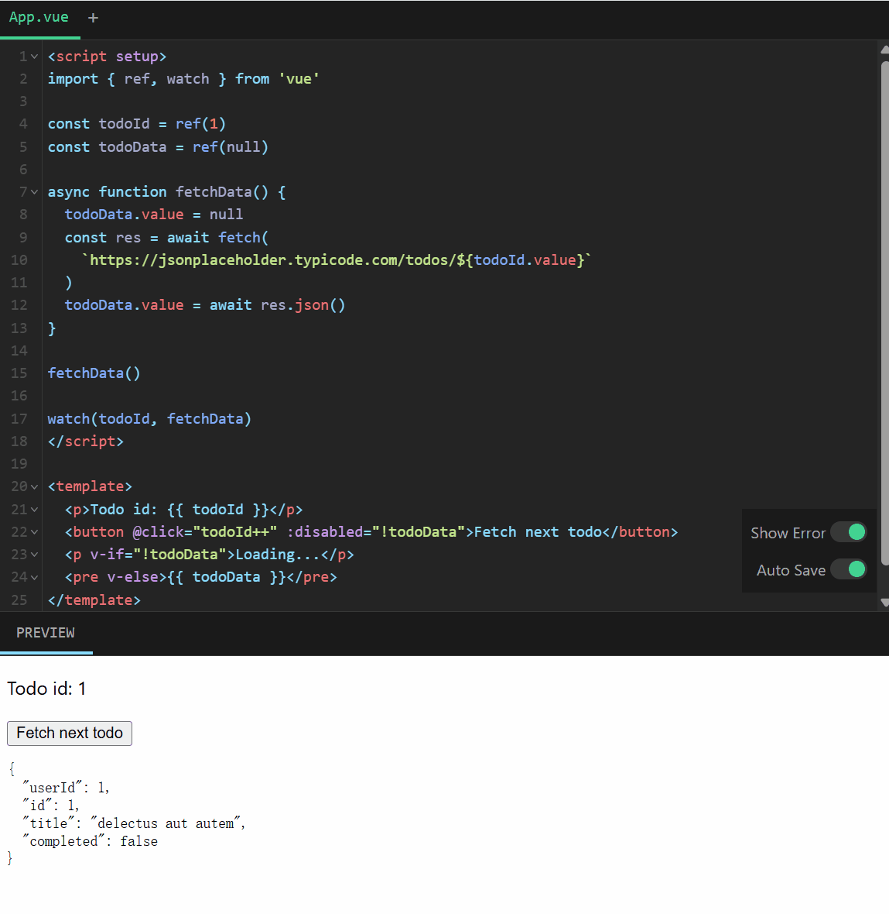
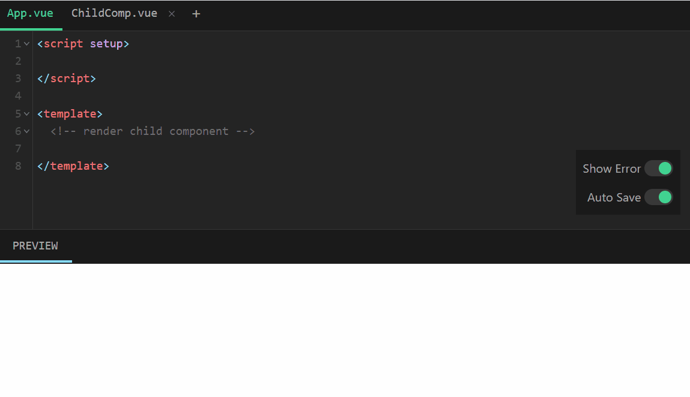
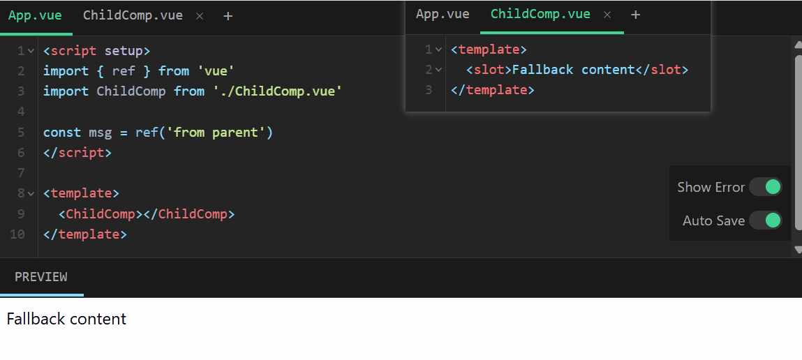

# vue3学习总结

from notion
Priority: Medium
Status: Done
Assignee: 柳岑 陆
Due: 2025年3月31日
上次编辑时间: 2025年3月30日 18:41
创建时间: 2025年3月28日 14:10

# **一. 关于Vue3**

Vue.js 是一个用于构建用户界面的 JavaScript 框架。它可以帮助你轻松地将数据和页面绑定在一起，当数据变化时，页面会自动更新。

Vue 3 是 Vue.js 框架的最新主要版本，于 2020 年 9 月正式发布。它相较于 Vue 2，在性能、功能和开发体验上有显著改进。

## vue3的核心特性

1. **组合式 API (Composition API)**
Vue 3 引入了组合式 API，作为选项式 API (Options API) 的补充。它允许开发者以更灵活的方式组织代码，通过 setup() 函数或 \<script setup> 语法，将相关逻辑集中在一起，提升代码可读性和复用性。
2. **性能优化**
• **渲染更快**：Vue 3 使用了 Proxy 替代 Vue 2 的 Object.defineProperty 实现响应式系统，提升了性能并减少了内存开销。
• **Tree-shaking 支持**：未使用的功能会被打包工具剔除，生成更小的构建文件。
• **虚拟 DOM 重写**：渲染速度更快，支持静态内容提升。
3. **Teleport**
新增的 <Teleport> 组件允许将子组件渲染到 DOM 中的任意位置，便于处理模态框、弹窗等场景。
4. **Fragments**
Vue 3 支持多根节点模板，无需额外的包裹元素，简化了组件结构。
5. **TypeScript 支持**
Vue 3 提供了更好的 TypeScript 集成，核心代码本身就是用 TypeScript 编写的，类型推导更友好，适合大型项目。
6. **新的工具和生态**
• Vite：Vue 3 推荐使用 Vite 作为构建工具，启动速度极快，支持热更新。
• Pinia：作为状态管理库的推荐选择，替代 Vuex。

# **二. 代码结构**

Vue3的代码通常分为三部分：

1. **模板（Template）**：HTML 部分，用来定义页面的结构。
2. **脚本（Script）**：JavaScript 部分，用来定义数据和逻辑。
3. **样式（Style）**：CSS 部分，用来定义页面的样式。



# 三.Vue3基础

## 1. 声明式渲染

声明式渲染，通过扩展于标准 HTML 的模板语法，我们可以根据 JavaScript 的状态来描述 HTML 应该是什么样子的。当状态改变时，HTML 会自动更新。Vue 3 使用模板语法来实现这一点。

- **模板语法**：Vue3 的模板语法基于 HTML 扩展，通过指令（如 `v-bind`、`v-if`、`v-for` 等）和表达式实现数据绑定和逻辑交互。
    - 插值表达式
        
        ```html
        <h1>{{ message }}</h1>
        ```
        
        这里的 message 是组件中的一个响应式数据，当 message 变化时，Vue 会自动更新 DOM。
        
    - 指令
- **响应式数据**：Vue 3 使用 `ref` 和 `reactive` 创建响应式数据。
    
    ```jsx
    <script setup>
    import { reactive, ref } from 'vue'
    
    const counter = reactive({ count: 0 })
    const message = ref('Hello World!')
    </script>
    
    <template>
      <h1>{{ message }}</h1>
      <p>Count is: {{ counter.count }}</p>
    </template>
    ```
    
    当 message 的值改变时，界面会自动重新渲染。
    


## 2. Attribute绑定

在 Vue 3 中，**v-bind 指令**用于动态绑定 HTML 属性（Attribute），让属性值可以根据数据动态变化。

- **基本用法**：使用 v-bind 或其简写 : 来绑定属性。例如：
    
    ```html
    <div v-bind:id="titleClass"></div>
    <!-- 简写 -->
    <div :id="titleClass"></div>
    ```
    
    这里的 titleClass 是一个响应式数据，当它变化时，src 属性会自动更新。
    
- **绑定多个属性**：Vue 3 允许通过对象语法一次性绑定多个属性：
    
    ```html
    <div v-bind="{ id: someId, class: someClass }"></div>
    ```
    
- **动态类和样式**：v-bind 也常用于动态绑定 class 和 style：
    
    ```html
    <div :class="{ active: isActive }">动态类</div>
    <div :style="{ color: textColor, fontSize: fontSize + 'px' }">动态样式</div>
    ```
    


## 3.事件监听

Vue 3 使用 **v-on 指令**（或简写 @）来监听 DOM 事件，并执行相应的方法。

- **基本用法**：监听点击事件并调用方法：
    
    ```html
    <button v-on:click="increment">{{ count }}</button>
    <!-- 简写 -->
    <button @click="increment">{{ count }}</button>
    ```
    
    组件中定义 increment 函数：
    
    ```jsx
    const count = ref(0)
    
    function increment() {
      count.value++
    }
    ```
    
- **事件修饰符**：Vue 3 提供了事件修饰符来简化事件处理，例如：
    - .stop：阻止事件冒泡。
    - .prevent：阻止默认行为。
    - .once：事件只触发一次。
    
    ```html
    <form @submit.prevent="onSubmit">提交</form>
    ```
    
- **按键修饰符**：监听键盘事件时，可以使用按键修饰符：
    
    ```html
    <input @keyup.enter="submitForm" placeholder="按回车提交">
    ```
    



这里`increment` 引用了一个在 `<script setup>` 中声明的函数

- 事件处理函数也可以使用内置表达式，并且可以使用修饰符简化常见任务。这些细节包含在[**指南 - 事件处理**](https://cn.vuejs.org/guide/essentials/event-handling.html)。
- 事件处理器 (handler) 的值可以是：
1. **内联事件处理器**：事件被触发时执行的内联 JavaScript 语句 (与 `onclick` 类似)。
2. **方法事件处理器**：一个指向组件上定义的方法的属性名或是路径。

## 4. 表单绑定

- 我们可以同时使用 `v-bind` 和 `v-on` 来在表单的输入元素上创建双向绑定：
    
    ```html
    <input :value="text" @input="onInput">
    ```
    
    ```jsx
    function onInput(e) {  
    // v-on 处理函数会接收原生 DOM 事件  
    // 作为其参数。  
    text.value = e.target.value
    }
    ```
    
- 为了简化双向绑定，Vue 提供了一个 `v-model` 指令，它实际上是上述操作的语法糖（简化）：
    
    ```jsx
    <input v-model="text">
    ```
    
    `v-model` 会将被绑定的值与 `<input>` 的值自动同步，这样我们就不必再使用事件处理函数了。
    
    `v-model` 不仅支持文本输入框，也支持诸如**多选框、单选框、下拉框**之类的输入类型。
    



## 5. 条件渲染

Vue 3 提供了 v-if、v-else 和 v-show 指令来实现条件渲染，根据条件动态显示或隐藏元素。

- 我们可以使用 `v-if` 指令来有条件地渲染元素：

```html
<h1 v-if="awesome">Vue is awesome!</h1>
```

这个 `<h1>` 标签只会在 `awesome` 的值为[**真值 (Truthy)**](https://developer.mozilla.org/zh-CN/docs/Glossary/Truthy) 时渲染。若 `awesome` 更改为[**假值 (Falsy)**](https://developer.mozilla.org/zh-CN/docs/Glossary/Falsy)，它将被从 DOM 中移除。

我们也可以使用 `v-else` 和 `v-else-if` 来表示其他的条件分支：

```html
<h1 v-if="awesome">Vue is awesome!</h1>
<h1 v-else>Oh no 😢</h1>
```

- 更多细节 `v-if`：[**指南 - 条件渲染**](https://cn.vuejs.org/guide/essentials/conditional.html)



- v-if和v-show的区别
    
    
    

## 6. 列表渲染

Vue 3 使用 v-for 指令来渲染列表数据，非常适合处理数组或对象数据的循环展示。

- `v-for` 指令可以用来渲染一个基于源数组的列表：
    
    ```html
    <ul>  
    	<li v-for="todo in todos" :key="todo.id">    
    	{{ todo.text }}  
    	</li>
    </ul>
    ```
    
    这里的 `todo` 是一个局部变量，表示当前正在迭代的数组元素。它只能在 `v-for` 所绑定的元素上或是其内部访问，就像函数的作用域一样。
    
    还给每个 todo 对象设置了唯一的 `id`，并且将它作为[**特殊的 `key` attribute**](https://cn.vuejs.org/api/built-in-special-attributes.html#key) 绑定到每个 `<li>`。`key` 使得 Vue 能够精确地移动每个 `<li>`，以匹配对应的对象在数组中的位置。
    
- 更新列表有两种方式：
    1. 在源数组上调用[**变更方法**](https://stackoverflow.com/questions/9009879/which-javascript-array-functions-are-mutating)：
        
        ```jsx
        todos.value.push(newTodo)
        ```
        
    2. 使用新的数组替代原数组：
        
        ```jsx
        todos.value = todos.value.filter(/* ... */)
        ```
        

这里是一个简单的 todo 列表



## 7. 计算属性

计算属性是 Vue 3 中用于处理复杂逻辑的特性，基于依赖的响应式数据自动计算结果，并且具有缓存机制。

- 介绍一个新 API：[**`computed()`**](https://cn.vuejs.org/guide/essentials/computed.html)。它可以让我们创建一个计算属性 ref，这个 ref 会动态地根据其他响应式数据源来计算其 `.value`：

```jsx
import { ref, computed } from 'vue'
const hideCompleted = ref(false)
const todos = ref([  /* ... */])
const filteredTodos = computed(() => {  
// 根据 `todos.value` & `hideCompleted.value`  
// 返回过滤后的 todo 项目
})
```

- **与方法的区别**：计算属性有缓存，只有当依赖的响应式数据变化时才会重新计算，而方法每次调用都会重新执行。



## 8. 生命周期和模板引用

- 有时我们也会不可避免地需要手动操作 DOM。
    
    这时就需要使用**模板引用**——也就是指向模板中一个 DOM 元素的 ref。我们需要通过[**这个特殊的 `ref` attribute**](https://cn.vuejs.org/api/built-in-special-attributes.html#ref) 来实现模板引用：
    
    ```html
    <p ref="pElementRef">hello</p>
    ```
    
    要访问该引用，需要在脚本中声明一个同名的 ref：
    
    ```jsx
    const pElementRef = ref(null)
    ```
    
    这个里ref 使用 `null` 值来初始化。因为当 `<script setup>` 执行时，DOM 元素还不存在。模板引用 ref 只能在组件**挂载**后访问。
    
- 要在挂载之后执行代码，我们可以使用 `onMounted()` 函数：
    
    ```jsx
    import { onMounted } from 'vue'onMounted(() => {  // 此时组件已经挂载。})
    ```
    
    这被称为**生命周期钩子，**Vue 3 提供的生命周期钩子，让开发者可以在组件的不同阶段执行自定义逻辑。组合式 API 中，生命周期钩子以 on 开头。
    
    - **常用生命周期钩子**：
        - onBeforeMount：组件挂载到 DOM 前。
        - onMounted：组件挂载完成后。
        - onBeforeUpdate：组件更新前。
        - onUpdated：组件更新后。
        - onBeforeUnmount：组件卸载前。
        - onUnmounted：组件卸载后。
    
    
    
    **生命周期图示**：
    
    
    

## 9. 侦听器

Vue 3 的 watch 函数用于侦听响应式数据的变化，并在变化时执行副作用逻辑。

- 有时我们需要响应性地执行一些“副作用”——例如，当一个数字改变时将其输出到控制台。可以通过侦听器来实现：
    
    ```jsx
    import { ref, watch } from 'vue'
    const count = ref(0)
    watch(count, (newCount) => {  
    // 这里console.log() 是一个副作用  
    console.log(`new count is: ${newCount}`)
    })
    ```
    
    `watch()` 可以直接侦听一个 ref，并且只要 `count` 的值改变就会触发回调。`watch()` 也可以侦听其他类型的数据源——更多详情请参阅[**指南 - 侦听器**](https://cn.vuejs.org/guide/essentials/watchers.html)。
    
    一个比在控制台输出更加实际的例子是当 ID 改变时抓取新的数据。下面的例子中就是这样一个组件。该组件被挂载时，会从模拟 API 中抓取 todo 数据，同时还有一个按钮可以改变要抓取的 todo 的 ID。
    
    
    

## 10. 组件

- 目前为止，我们只使用了单个组件。真正的 Vue 应用往往是由嵌套组件创建的。
    
    父组件可以在模板中渲染另一个组件作为子组件。要使用子组件，需要先导入它：
    
    ```jsx
    import ChildComp from './ChildComp.vue'
    ```
    
    然后就可以在模板中使用组件，就像这样：
    
    ```html
    <ChildComp />
    ```
    
- 在父组件中导入子组件并渲染。
    
    
    

## 11. Props

Props 是 Vue 3 中父组件向子组件传递数据的主要方式，允许组件之间进行单向数据流。

- 用法：首先，需要声明它所接受的 props：
    
    ```jsx
    <!-- ChildComp.vue -->
    <script setup>
    const props = defineProps({
    								msg: String
    								})
    </script>
    ```
    
     `defineProps()` 是一个编译时宏，并不需要导入。一旦声明，`msg` prop 就可以在子组件的模板中使用。它也可以通过 `defineProps()` 所返回的对象在 JavaScript 中访问。
    
    父组件可以像声明 HTML attributes 一样传递 props。若要传递动态值，也可以使用 `v-bind` 语法：
    
    ```jsx
    <ChildComp :msg="greeting" />
    ```
    


- **补充：Props 验证**：可以为 Props 指定类型、默认值、是否必填等：
    
    ```jsx
    props: {
      message: {
        type: String, // 类型
        required: true, // 是否必填
        default: '默认消息' // 默认值（如果不是必填）
      },
      count: {
        type: Number,
        default: 0
      }
    }
    ```
    

## 12. Emits

Emits 是 Vue 3 中子组件向父组件通信的方式，通过触发自定义事件，子组件可以通知父组件执行某些操作。

- 子组件通过 $emit 或 emits 选项触发事件：
    
    ```html
    <script setup>
    // 声明触发的事件
    const emit = defineEmits(['response'])
    // 带参数触发
    emit('response', 'hello from child')
    </script>
    ```
    
    `emit()` 的第一个参数是事件的名称。其他所有参数都将传递给事件监听器。
    
    父组件可以使用 `v-on` 监听子组件触发的事件——这里的处理函数接收了子组件触发事件时的额外参数并将它赋值给了本地状态：
    
    ```html
    <ChildComp @response="(msg) => childMsg = msg" />
    ```
    
    - `<ChildComp>`：子组件的标签。
    - `@response`：监听子组件触发的名为 `response` 的自定义事件。
    - `(msg) => childMsg = msg`：事件处理函数，当子组件触发 `response` 事件时：
        - `msg`：子组件传递的事件参数。
        - 将 `msg` 赋值给父组件的响应式变量 `childMsg`。
    
    
    
    在子组件使用 `defineEmits` 定义事件类型（可选类型检查）
    
    在子组件的方法中调用 `emit('response', payload)` 发送事件
    • **`@click="$emit('close')"`**：当按钮被点击时，触发 `close` 事件，通知父组件关闭模态框。
    
    
    

## 13. 插槽

- 除了通过 props 传递数据外，父组件还可以通过**插槽** (slots) 将模板片段传递给子组件：

```html
<ChildComp>  This is some slot content!</ChildComp>
```

在子组件中，可以使用 `<slot>` 元素作为插槽出口 (slot outlet) 渲染父组件中的插槽内容 (slot content)：

```html
<!-- 在子组件的模板中 -->
<slot/>
```

`<slot>` 插口中的内容将被当作“默认”内容：它会在父组件没有传递任何插槽内容时显示：

```html
<slot>Fallback content</slot>
```

现在我们没有给 `<ChildComp>` 传递任何插槽内容，所以你将看到默认内容。让我们利用父组件的 `msg` 状态为子组件提供一些插槽内容吧。



- **具名插槽**：通过 name 属性定义多个插槽：
    
    ```jsx
    // ChildComponent.vue
    <template>
      <div>
        <slot name="header">默认头部</slot>
        <slot>默认内容</slot>
        <slot name="footer">默认底部</slot>
      </div>
    </template>
    ```
    
    父组件使用 v-slot 指定插槽：
    
    ```jsx
    <ChildComponent>
      <template v-slot:header>
        <h1>自定义头部</h1>
      </template>
      <p>默认插槽内容</p>
      <template v-slot:footer>
        <p>自定义底部</p>
      </template>
    </ChildComponent>
    ```
    
    简写形式：v-slot:header 可以写成 #header。
    
- **作用域插槽**：子组件可以向插槽传递数据，父组件通过 v-slot 接收：
    
    ```jsx
    // ChildComponent.vue
    <template>
      <slot :user="user">{{ user.name }}</slot>
    </template>
    <script>
    export default {
      setup() {
        const user = { name: '张三', age: 25 };
        return { user };
      }
    };
    </script>
    ```
    
    父组件使用：
    
    ```jsx
    <ChildComponent>
      <template v-slot="{ user }">
        <p>{{ user.name }} - {{ user.age }} 岁</p>
      </template>
    </ChildComponent>
    ```
    

插槽机制让组件的内容更加灵活，特别适合构建通用的布局组件（如卡片、模态框等）。

# 四、实践

### **1. 新建项目**

如果需要新建一个项目，可以使用 [Vite](https://github.com/vitejs/vite)、[Rsbuild](https://github.com/web-infra-dev/rsbuild) 或 [Vue CLI](https://github.com/vuejs/vue-cli)。

请使用命令行来初始化项目：

- Vite:

```bash
$ npm create vite@latest

```

- Rsbuild:

```bash
$ npm create rsbuild@latest

```

- Vue CLI:

```bash
$ npm install -g @vue/cli
# OR
$ yarn global add @vue/cli

$ vue create antd-demo

```

> Vue CLI 已经停止迭代，因此不推荐使用。
> 

若安装缓慢报错，可尝试用 `cnpm` 或别的镜像源自行安装：`rm -rf node_modules && cnpm install`。

### **2. 使用组件**

### **安装**

```bash
$ npm i --save ant-design-vue@4.x

```

### **注册**

如果使用 Vue 默认的模板语法，需要注册组件后方可使用，有如下三种方式注册组件：

**全局完整注册**

```jsx
import { createApp } from 'vue';
import Antd from 'ant-design-vue';
import App from './App';
import 'ant-design-vue/dist/reset.css';

const app = createApp(App);

app.use(Antd).mount('#app');

```

以上代码便完成了 Antd 的全局注册。需要注意的是，样式文件需要单独引入。

**全局部分注册**

```jsx
import { createApp } from 'vue';
import { Button, message } from 'ant-design-vue';
import App from './App';

const app = createApp(App);

/* 会自动注册 Button 下的子组件, 例如 Button.Group */
app.use(Button).mount('#app');

app.config.globalProperties.$message = message;

```

**局部注册组件**

此种方式需要分别注册组件子组件，如 Button、ButtonGroup，并且注册后仅在当前组件中有效。所以推荐使用上述两种方式。

```html
<template><a-button>Add</a-button></template><script>
  import { Button } from 'ant-design-vue';
  const ButtonGroup = Button.Group;

  export default {
    components: {
      AButton: Button,
      AButtonGroup: ButtonGroup,
    },
  };
</script>
```

# 五.vue3生态

(一)Vue Cli

[Home | Vue CLI](https://cli.vuejs.org/zh/index.html)

Vue.js 的官方脚手架工具，用于快速搭建基于 Vue 的项目。它提供了项目生成、开发服务器、构建工具等功能。虽然 Vue Cli 在 Vue2 时代非常流行，但在 Vue3 中逐渐被 Vite 取代。不过，它仍然支持 Vue3，提供了一套稳定的开发体验，适合习惯传统工作流的用户。

(二)Vue Router

[Vue Router | Vue.js 的官方路由](https://router.vuejs.org/zh/index.html)

Vue.js 的官方路由管理库，用于构建单页应用（SPA）。在 Vue3 中，Vue Router 升级到了 4.x 版本，与 Vue3 的 Composition API 深度整合。它支持动态路由、嵌套路由、路由守卫等功能，是 Vue 项目中导航管理的核心工具。

(三)Vuex

[Vuex 是什么？ | Vuex](https://vuex.vuejs.org/zh/index.html)

Vue.js 的官方状态管理库，适用于大型应用的全局状态管理。在 Vue3 中，Vuex 的最新版本是 4.x，完全兼容 Vue3。尽管如此，Vuex 正在逐渐被 Pinia 取代，因为后者更轻量且与 Vue3 的设计理念更契合。不过，Vuex 依然是一个成熟的选择。

(四)Vite

[Vite | 下一代的前端工具链](https://cn.vitejs.dev/)

Vue 生态中的新一代构建工具，由 Vue 作者尤雨溪开发。它以快速冷启动、高效热更新和按需编译为特点，取代了传统的 Webpack 打包方式。Vite 原生支持 Vue3，被视为 Vue3 项目的首选开发工具，广泛应用于现代前端开发。

(五)Pinia

[Home | Pinia](https://pinia.web3doc.top/)

Vue3 推荐的状态管理库，被认为是 Vuex 的继任者。它与 Vue3 的 Composition API 无缝衔接，提供了更简洁的 API、更强的类型支持和更好的模块化能力。相比 Vuex，Pinia 更轻量且去除了繁琐的 mutations，使用起来更直观。

# 六.Vue3组件库

(一)Ant-design-vue

[Ant Design of Vue - Ant Design Vue](https://antdv.com/docs/vue/introduce-cn/)

Ant-design-vue 是基于 Ant Design 设计体系的 Vue 组件库，适用于 Vue3 的版本是 2.x 及以上。它提供了丰富的企业级 UI 组件，如表格、表单、模态框等，风格现代且专业，非常适合后台管理系统开发。

(二)vant3.0

[Vant Doc | 组件 中文文档 documentation | v2.13.2 v2.0 v2.x | Vant UI (for vue 2.0) | Vue UI Component for mobile phone | Vant js](https://develop365.gitlab.io/vant/v2/zh-CN/home/)

Vant 是一个**轻量、可靠的移动端组件库**，于 2017 年开源。它体积小、性能优异，适合快速开发移动应用或小程序。目前 Vant 官方提供了 [Vue 2 版本](https://vant-contrib.gitee.io/vant/v2)、[Vue 3 版本](https://vant-contrib.gitee.io/vant)和[微信小程序版本](http://vant-contrib.gitee.io/vant-weapp)，并由社区团队维护 [React 版本](https://github.com/3lang3/react-vant)和[支付宝小程序版本](https://github.com/ant-move/Vant-Aliapp)。

(三)Element Plus

[一个 Vue 3 UI 框架 | Element Plus](https://element-plus.org/zh-CN/#/zh-CN/component/installation)

Element UI 的升级版，专为 Vue3 重写。它继承了 Element UI 的设计风格，提供了大量桌面端 UI 组件，如输入框、选择器、对话框等。Element Plus 是目前 Vue3 生态中最流行的桌面组件库之一，适合中后台项目。

(四)Element3

https://github.com/hug-sun/element3

Element3 是另一个基于 Vue3 的组件库，与 Element Plus 类似，但由不同团队开发。它试图在 Element UI 的基础上进行优化，提供更轻量和现代化的组件实现。不过，它的社区活跃度和成熟度相对较低，使用时需评估其稳定性。

(五)Native UI

https://github.com/tusen-ai/naive-ui

Native UI 是一个较小众的 Vue3 组件库，专注于提供接近原生体验的 UI 组件。它可能更适合特定场景或轻量级项目，但文档和生态支持相对较弱，使用前建议仔细研究其功能和适用性。