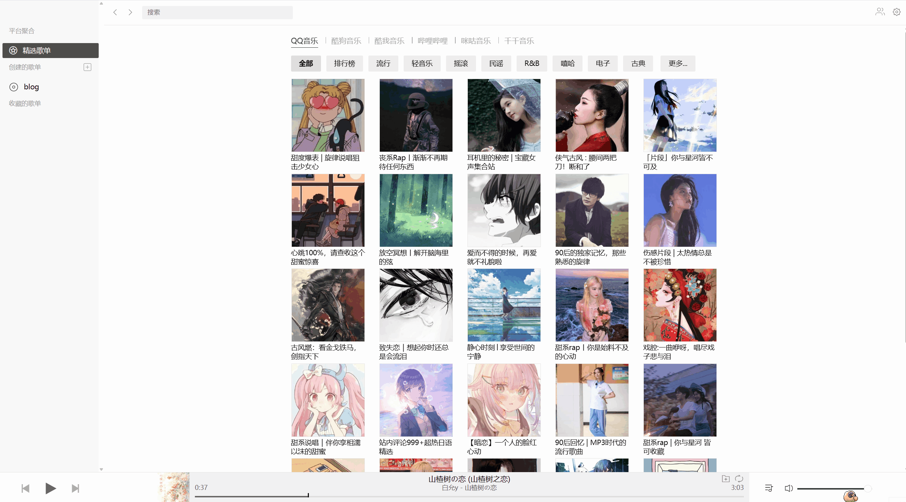

# 个人博客搭建

摘要

from notion

### 博客系统组成

个人博客由四个核心部分组成：

1. 博客生成框架：将用户简单输入转化为完整网站（HTML、CSS、JS）
2. 文件托管平台：将文件存储在云端并提供访问修改接口
3. 站点部署服务：将网站部署到互联网供他人访问
4. 访问加速服务：通过CDN提高网站访问速度

### 技术选型

本教程选择的技术栈：

- Hexo：博客生成框架，基于Node.js
- GitHub：文件托管平台
- Netlify：站点部署服务（比GitHub Pages在国内访问速度更快）
- Cloudflare：提供CDN加速服务

### 搭建步骤

1. 配置Node.js环境
    - Mac：使用`brew install node`
    - Linux：通过命令行安装
    - Windows：从官网下载安装包（建议在Git Bash中使用）
    - 安装后检查：`node -v`和`npm -v`
    - 可选：将npm源修改为淘宝源加速
2. 安装Hexo框架
    - 全局安装Hexo：`npm install -g hexo-cli`
    - 初始化博客：`hexo init 博客路径`
    - 安装依赖：`cd 博客路径` 然后 `npm install`
    - 修改package.json，添加Netlify构建命令
3. 推送到GitHub
    - 创建GitHub仓库
    - 将本地博客目录推送到GitHub
4. Netlify建站
    - 注册登录Netlify（需科学上网）
    - 连接GitHub仓库
    - 构建命令设置为`npm run netlify`
    - 获取netlify.app域名
5. 配置自定义域名
    - 在域名服务商处配置CNAME解析
    - 在Netlify配置个人域名
    - 开启Netlify的CDN服务
6. Cloudflare加速配置
    - 注册登录Cloudflare
    - 添加自己的域名
    - 修改DNS服务器为Cloudflare提供的服务器
    - 在Netlify配置HTTPS访问

### 下一步建议

完成基础搭建后，可以:

- [ ]  进一步美化和装饰个人博客
- [ ]  开始撰写高质量内容
- [ ]  将博客地址分享到评论区与他人交流
		

## hexo

### 常用命令

1. 创建post
    
    ```bash
    hexo new "My New Post"
    ```
    
2. 启动服务
    
    ```bash
    hexo serve
    hexo s  # 简写
    hexo s -w  # 监听源文件的变化 
    ```
    
3. 生成静态文件
    
    ```bash
    hexo generate
    ```
    
4. 部署远程网站
    
    ```bash
    hexo deploy
    ```
    

## 更换主题

在官网[Themes | Hexo](https://hexo.io/themes/)找到喜欢的主题


主题文档会提供下载方式，推荐使用npm下载，复制命令到博客文件夹根目录执行即可。

然后在总配置文件中找到`theme`配置项，修改为新配置的主题名，最后新建一个主题配置文件，填入主题文档中提供的配置内容即可。


> 我用的主题是：redifine
主题文档：[快速开始 | Hexo Theme Redefine Docs](https://redefine-docs.ohevan.com/zh/getting-started)
主题演示站点：[Theme Redefine - Redefine Your Hexo Journey.](https://redefine.ohevan.com/)
> 

## 上传博文图片路径无法正确解析的问题

> 在 Hexo 中，最简单的插入图片的方法，就是在 source 目录中新建一个 images（名字可自定义）文件夹，将图片都存入 images 文件夹中，然后在 Markdown 中使用``的格式，比如我们当前有一个名为 image1.png 的图片，就是``，这里的`/`是指的根目录，而 Hexo 中，资源文件的根目录就是 source 文件夹。
> 

这样我们就插入了一张图片，但是这样做的话有几个麻烦点：

1. 所有的图片都在同一个文件夹下，管理会很混乱很麻烦
2. 每次引用图片都需要去手动输入，当然也可以修改 [Typora](https://zhida.zhihu.com/search?content_id=231614889&content_type=Article&match_order=1&q=Typora&zhida_source=entity) 的目录地址，直接设置为 images 目录

由于我的需求是从notion和typora中导入md文件，目前找到的最方便的方法（虽然还是很麻烦）：

1. 根据 Hexo 官方文档，在 `_config.yaml` 将 `post_asset_folder` 选项设为 `true`
    
    这样在终端使用 `hexo new [layout] <title>` 命令创建一篇新文章，此时会在 source/_post 目录下创建一个同名的文件夹和 Markdown 文件。
    
    接着可以把所有该文章有关的资源文件都放在同名的目录中，然后使用引入格式 `` 即可引入图片，该方法在有较多文章和较多资源时比较方便管理，但相对的确实比较麻烦
    
2. 安装插件 `hexo-image-link`，安装命令为：
    
    ```bash
    $ npm install hexo-image-link --save
    ```
    
3. 配置 Markdown 编辑器 Typora 偏好如下
    
    
    
4. notion导出md文件由他自己的方式，没有找到修改方法，只能手动将图片移入同名文件夹中，并手动修改路径。

### 博文图片

放在博问同名文件夹中

### 非博文图片

放在sourse文件夹中新建文件夹，如images

### 正在编辑的博文

1. 用typora打开/source/_posts文件夹下的xxx.md，，开始写作
2. 当你在md文档里面粘贴一张图片的时候，typora会帮你在同目录下新建同名文件夹，用来存储这张图片，而且语法里面的路径是这个同名文件夹的路径，比较方便

### 编辑好的博文

**typora**

直接将博文及同名图片文件夹导入到sourse/_posts下

**notion**

将导出文件夹解压并打开，重命名md文件删除多余后缀，先将md文件移动到source/_posts文件夹下，再将包含所有图片的文件夹重命名为与博文同名的文件夹并移动到source/_posts下，最后手动改一下博文中的图片路径（输入`./`）开始选择

### 注意

更新了带有图片的博文或代码需要执行以下命令

```bash
hexo clen
hexo g
hexo s
```

# APlayer音乐播放器

按照主题文档[APlayer 音乐播放器 | Hexo Theme Redefine Docs](https://redefine-docs.ohevan.com/zh/plugins/aplayer)的示例配置可以轻松配置开发者提供的两首歌曲，我主要分享一下配置其它自己喜欢的歌曲的方式。

```bash
plugins:
    aplayer: # APlayer (fixed version)
        enable: false
        type: fixed # fixed, mini
        audios:
            - name: # audio name
              artist: # audio artist
              url: # audio url
              cover: # audio cover url
            - name:
              artist:
              url:
              cover:
```

我们需要提供的主要就是`name`，`artist`，`url`，`cover`。

歌曲和封面的外链获取方式：

1. 在浏览器插件市场获取`listen 1`扩展并下载打开[https://microsoftedge.microsoft.com/addons/detail/listen-1/bcneiehcbgahghfmgigmblcgkhihehad](https://microsoftedge.microsoft.com/addons/detail/listen-1/bcneiehcbgahghfmgigmblcgkhihehad)
    
    
    
2. 右键页面打开开发者模式，如下图方式获取歌曲及封面连接
    
    
    

3.填写到主题配置文件中

```bash
      - name: 山楂树之恋
        artist: "白允y"
        url: http://ws.stream.qqmusic.qq.com/M500000Gr4d21lvZYs.mp3?guid=10000&vkey=4B029DCC1E180FA4E0ECF79ABF37C8D3B1BE1395029A45F4FB623CE269C3CF2A1DEE04A024D4759361797AF70FFA33848DD68AB2554405FF__v21e2a171d&uin=&fromtag=120042
        cover: https://y.gtimg.cn/music/photo_new/T002R300x300M0000041edIs2vco5E.jpg
```

# 未完待续。